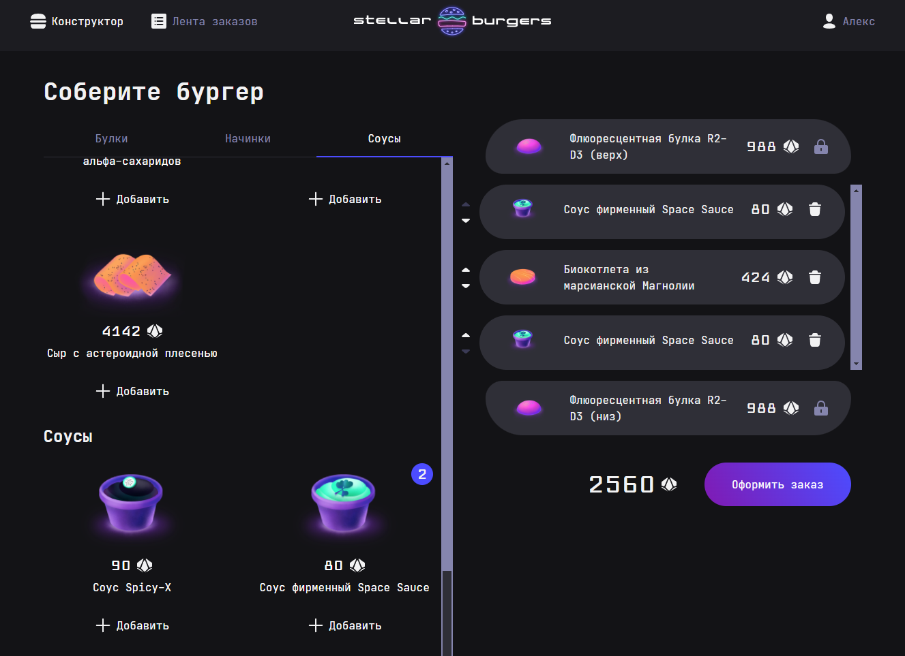

# Сервис заказа еды(TypeScript, React, Redux)

## Функционал
- Главная страница, отображает ингридиенты, вы можете собрать свой бургер и оформить заказ
- Реализован личный кабинет, регистрация, восстановление пароля, список своих заказов в личном кабинете.

### Инструкция по запуску
- Создайте папку для проекта и перейдите в неё.
- Склонируйте репозиторий `git clone git@github.com:AplusO1/stellar-burgers.git`
- Для корректной работы запросов к серверу необходимо добавить переменную BURGER_API_URL в окружение. Сама ссылка находится в файле `.env.example`.
- Установите зависимости `npm install`
- Запускайте проект `npm run start`
---
